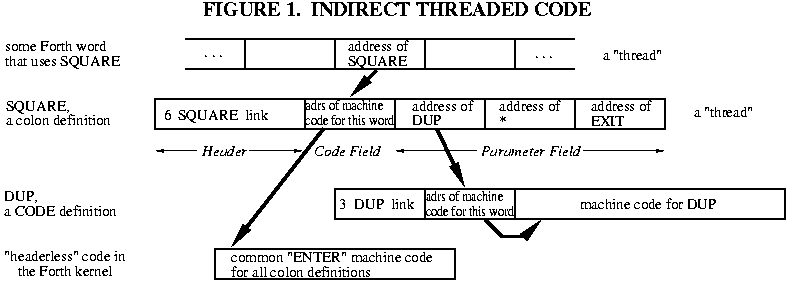
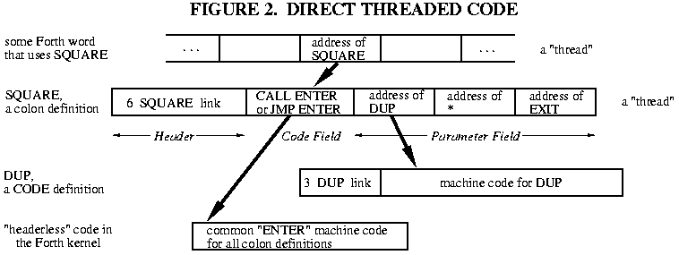
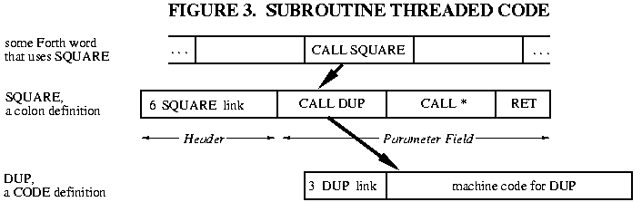
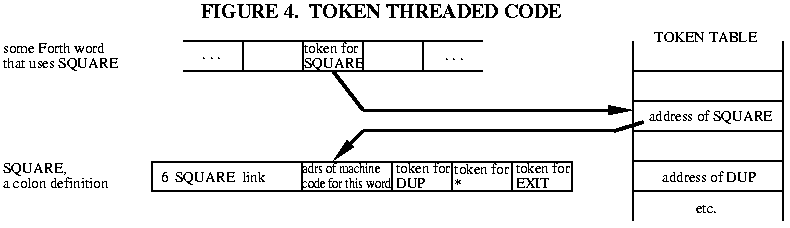

# Part 1: Design Decisions in the Forth Kernel

> This article first appeared in The Computer Journal #59 (January/February 1993).

# INTRODUCTION

Forthコミュニティの誰もが、Forthを新しいCPUに移植するのがいかに簡単かを語っています。しかし、多くの"簡単"で"明白"な作業と同様に、その方法について書かれたものは多くありません。そこで、Bill Kiblerがこのトピックを記事にしようと提案したとき、私はForth書き(Forthwrights)の偉大な口伝の殻を破って、そのプロセスを良し悪しともども文書として記すことにしました。

この記事の中で、私は6809、8051、Z80用のForthを開発する予定です。6809は、簡単で一般的なForthのモデルを説明するために使います。また、6809のアセンブラ[ROD91,ROD92]をすでに発表しており、今後、TCJ(The Computer Journal)プロジェクトで6809のForthが必要としているのです。8051 Forthは大学のプロジェクトでやっているのですが、ちょっと変わった設計上の決定があることも示しています。Z80 Forthは、TCJのCP/Mを使う読者や、TRS-80が埃をかぶっている友人のためにあります。

# THE ESSENTIAL HARDWARE

まず、CPUを選択する必要があります。CPUの選択は通常、他の考慮事項によって強制されるため、Forthについて、あるCPUと他のCPUの利点を掘り下げることはしません。それに、この記事の目的は、Forthを<u>どのような</u>CPUでも使えるようにする方法を示すことです。

通常の16ビットForthカーネル(下記参照)は、約8Kバイトのプログラムスペースを占有すると考えてよいです。Forthの定義をコンパイルできるフルカーネルの場合、最低でも1KバイトのRAMを確保する必要があります。ディスクストレージにForthのブロック管理システムを使用するには、バッファ用に3Kバイト以上を追加する必要があります。32ビットForthモデルの場合は、これらの数値を2倍にしてください。

以上が、Forthカーネルを立ち上げるための最低条件です。ハードウェア上でアプリケーションを実行するには、PROMとRAMのサイズを適切な大きさにする必要があります。

# 16 OR 32 BIT?

Forthが使用するワードサイズは、必ずしもCPUのそれと同じではありません。実用的な最小のForthは16ビットモデル、つまり16ビット整数と16ビットアドレスを使用するものです。ワードとはForthの定義のことなので、Forthのコミュニティではこれを"セル"サイズと呼んでいます。

8ビットCPUは、必ずと言っていいほど16ビットForthをサポートしています。8ビットCPUの中には、16ビット演算をいくつか持っているものもありますが、通常はダブルバイト演算を明示的にコーディングする必要があります。

16ビットCPUでは、一般的に16ビットForthが動作しますが、同じ倍精度技術を使えば、16ビットCPUで32ビットForthを書くことができます。少なくとも1つの32ビットForthが8086/8088のために書かれています。

32ビットCPUは通常、32ビットForthを実行します。より小さなForthモデルによって、コードの長さやプロセッサの時間が節約されることはほとんどありません。しかし、私は68000用に書かれた16ビットForthを少なくとも1つ知っています。これは、高レベルのForth定義が32ビットアドレスの列ではなく、16ビットアドレスの列になるため、アプリケーションのコードサイズを2分の1に縮小することができます。(しかし、ほとんどの68000は十分なRAMを持っています。

この記事で説明する例はすべて、8ビットCPU上で動作する16ビットForthです。

# THE THREADING TECHNIQUE

"スレッドコード"はForthの特徴です。Forthの"スレッド"とは、実行されるルーチンのアドレスの単なるリストです。これは、CALL命令を取り除いたサブルーチン呼び出しのリストと考えることができます。長年にわたり、多くのスレッドのバリエーションが考案されてきました。どれが最適かはCPUとアプリケーションに依存します。どのスレッドが最適かは、CPUやアプリケーションによって異なりますが、どのように動作し、どのようなトレードオフがあるのかを理解した上で、決定する必要があります。

## Indirect Threaded Code (ITC)

ITC(間接スレッドコード)はForthの古典的なスレッディング技術で、fig-ForthやF83で使われており、Forthに関するほとんどの本で説明されています。他のスレッド方式はすべてこれを"改良"したものなので、他の方式を吟味するためにはITCを理解する必要があります。

Forthのワード`SQUARE`の定義を見てみましょう。

```
    : SQUARE DUP * ;
```
典型的なITC Forthでは、これは図1のようにメモリ上に表示されます(ヘッダについては今後の記事で説明します。ヘッダはコンパイルに必要な管理情報を保持しており、スレッド化には関係ありません)。



あるForthワードを実行しているとき`SQUARE`に遭遇したとします。Forthのインタプリタ・ポインタ(IP)は、"他の"ワードに含まれるメモリ内のセルを指しており、そのセルにはワード`SQUARE`のアドレスが含まれています(正確には、そのセルには`SQUARE`のコードフィールドのアドレスが含まれています)。インタープリタはそのアドレスをフェッチし、それを使って`SQUARE`のコードフィールドの内容をフェッチします。この内容は、さらに別のアドレス、つまり`SQUARE`というワードを実行する機械語のサブルーチンのアドレスです。疑似コードでは、次のようになります。

```
   (IP) -> W  fetch memory pointed by IP into "W" register
              ...W now holds address of the Code Field
   IP+2 -> IP advance IP, just like a program counter
              (assuming 2-byte addresses in the thread)
   (W) ->  X  fetch memory pointed by W into "X" register
              ...X now holds address of the machine code 
   JP (X)     jump to the address in the X register
```
これは、重要だがあまり知られていない原理を説明するものです。<u>入力したばかりのForthのワードのアドレスはWに保持されます</u>。コードワードはこの情報を必要としませんが、他のすべての種類のForthワードは必要とします。

もし`SQUARE`が機械語で書かれていたとしたら、これで話は終わりです。機械語のビットが実行され、Forthインタープリタにジャンプして戻ります--IPが増分されたので、実行される<u>次の(next)</u>ワードを指しているのです。Forthのインタプリタが通常`NEXT`と呼ばれるのはこのためです。

しかし、`SQUARE`は高レベルの"コロン"定義です -- それは"スレッド"、すなわちアドレスのリストを保持します。この定義を実行するために、Forthインタープリタは新しい場所、つまり`SQUARE`のパラメータフィールドで再スタートしなければなりません。もちろん、`SQUARE`が終了したら"他の"Forthワードを再開するために、インタプリタの古い場所を保存しておかなければなりません。これはサブルーチンの呼び出しと同じです。`SQUARE`の機械語の動作は、古いIPをプッシュし、IPを新しい場所に設定し、インタプリタを実行し、`SQUARE`が終了したらIPをポップする、という単純なものです(IPは高レベルForthの"プログラムカウンタ"であることがお判りいただけると思います)。

```
   PUSH IP     onto the "return address stack"
   W+2 -> IP   W still points to the Code Field, so W+2 is 
               the address of the Body!  (Assuming a 2-byte
               address -- other Forths may be different.)
   JUMP to interpreter ("NEXT")
```

このコード断片とまったく同じものは、すべての高レベル(つまりスレッド化された)Forth定義で使用されています! このため、このコード断片自体ではなく、このコード断片へのポインタがForth定義に含まれています。何百もの定義を経て、この節約は積もり積もって大きなものとなります! そして、これが間接スレッドと呼ばれる所以です。

"サブルーチンからのリターン"はEXITというワードで、Forthが`;`(セミコロン)に遭遇したときにコンパイルされます(ForthによってはEXITの代わりに`;S`と呼ぶものもあります)。 EXITは、次のような機械語ルーチンを実行するだけです。
```
   POP IP   from the "return address stack"
   JUMP to interpreter
```
Forthのネストされた定義をいくつか見て、これが機能することを確認してください。

ITCの特徴として、Forthの<u>すべての</u>ワードは1セルのコードフィールドを持っています。コロン定義は、定義で使用されている各ワードに対して1つのセルをコンパイルします。また、Forthのインタープリタは、次に実行するマシンコードのアドレスを得るために、実際には2重の間接参照を実行しなければなりません(まずIPを経由し、次にWを経由する)。

ITCは最小のスレッド技術でも最速のスレッド技術でもありません。もっともシンプルなものかもしれませんが、DTC(次に説明)もこれ以上に複雑とはいえません。では、なぜ多くのForthが間接スレッドなのか? その理由は、主に、これまでのForthを作る際にお手本として使われていた以前のForthが間接スレッドだったからです。最近では、DTCが主流になってきています。

では、ITCはどのような場合に使うのでしょうか。さまざまな手法の中で、ITCは最もクリーンでエレガントな定義、つまりアドレスのみを生成します。もし、あなたがそのようなことを考慮するならば、ITCは魅力的かもしれません。また、定義体の内部をいじくり回すようなコードを書いている場合は、ITCの表現がシンプルで統一されているため、移植性が高まるかもしれません。ITCは古典的なForthのモデルですから、教育用としても好まれるかもしれません。また、1802のようなサブルーチンコール命令のないCPUでは、ITCの方がDTCよりも効率的な場合が多いです。

## Direct Threaded Code (DTC)

直接スレッドコードがITCと異なる点はただ1つ、コードフィールドに何らかの機械語のアドレスが含まれるのではなく、コードフィールドに実際の機械語そのものが含まれることです。

これは、`ENTER`の完全なコードが、一つ一つのコロン定義に含まれていると言っているのではありません。"高水準"のForthワードでは、図2に示すように、コードフィールドにはサブルーチンの呼び出しが含まれます。例えばコロン定義は、ENTERルーチンの呼び出しを含んでいます。



直接スレッドにおけるNEXT擬似コードは、以下のように単純なものです。
```
   (IP) -> W   fetch memory pointed by IP into "W" register
   IP+2 -> IP  advance IP (assuming 2-byte addresses)
   JP (W)      jump to the address in the W register
```
高速化: これにより、インタプリタが実行するインダイレクトは1つだけになり、速度が向上しました。Z80では、Forthカーネルで最も使用されているNEXTルーチンが11命令から7命令に減少しています。

メモリ使用のコスト: 例えばZ80のForthでは、2バイトのアドレスが3バイトの呼び出しに置き換わったため、高レベルの定義はすべて1バイト長くなっています。しかし、これは普遍的なことではありません。32ビットの68000 Forthでは、4バイトのアドレスが4バイトのBSR命令に置き換えられても、正味の損失はありません。また、DTC Forth用のマシン命令を持つZilog Super8では、2バイトのアドレスは1バイトの`ENTER`命令に置き換えられ、Super8ではDTC Forthの方が小さくなってしまうのです!

DTCでは、コード定義も、ポインタがまったく不要になったので、2バイト短くなりましたよ!

私はかつて、DTC Forthの高レベルの定義には、コードフィールドのサブルーチンコール使用が必須だと考えていました。Frank SergeantのPygmy Forth [SER90]は、単純なジャンプ命令が同じように簡単に使えること、そして通常より高速であることを実証してくれました。

Guy Kelly は IBM PC のための Forth 実装のすばらしいレビューをまとめました [KEL92]。彼が調査した19のForthのうち、10がDTCを、7がITCを、そして2がサブルーチン・スレッディング(次で説明)を使用していました。私は、<u>すべての新しいForthカーネルにはIndirect-Threaded CodeよりもDirect-Threaded Codeの使用を推奨しています</u>。

## Jump to NEXT, or code it in-line?

Forthの内部インタプリタである`NEXT`は、すべてのコード定義における共通ルーチンです。この共通ルーチンのコピーを1つだけ保持し、すべてのコードワードがそこにジャンプするようにしてもよいです(NEXTにジャンプすることに注意。サブルーチンCallは必要ない)。

しかし、NEXTの速度はForthシステム全体の速度にとって重要です。また、多くのCPUでは、NEXTルーチンは非常に短く、2～3命令しかないことが多いです。そのため、NEXTが使用される場所でインラインコーディングすることが望ましいかもしれません。これは、NEXTをアセンブラマクロにすることでよく行われます。

これは、速度とコードサイズの単純なトレードオフ問題です。インラインNEXTは常に高速ですが、ほとんどの場合サイズが大きくなります。サイズの増加は、インライン拡張に必要な余分なバイト数に、システムのコードワード数を掛けたものです。トレードオフが全くない場合もあります。6809 DTC Forthでは、インライン`NEXT`の方がジャンプ命令より短いのです!

## Subroutine Threaded Code (STC)

高レベルのForth定義は、実行されるサブルーチンのリストにほかなりません。インタープリタがなくても、サブルーチン呼び出しを並べるだけで同じ効果が得られます。
```
SQUARE: CALL DUP
        CALL *     ; or a suitable alphanumeric name
        RET
```
図3をご覧ください。このForthのワードの表現は、Forthのスレッド化技術をアセンブリ言語のプログラマに説明する際の出発点として使用されました[KOG82]。



STCはエレガントな表現で、コロン定義とコードワードは同一になりました。"定義されたワード"(`VARIABLE`、`CONSTANT`など)はDTCと同じように扱われ、コードフィールドは他の場所の機械コードへのジャンプまたは呼び出しから始まります。

主な欠点は、サブルーチンコールが単純なアドレスよりも大きくなることです。例えばZ80の場合、コロン定義のサイズは50％増加します。逆に、32ビットの68000では、4バイトのアドレスが4バイトのBSRに置き換わっても、サイズが全く増えないかもしれません。(ただし、コードサイズが64Kを超える場合は、そのアドレスの一部を6バイトのJSRに置き換える必要がある)。

サブルーチンスレッディングはダイレクトスレッディングより速いかもしれません。インタプリタがない分、時間は節約できますが、Forthワードを参照するたびにリターン・アドレスのプッシュとポップが発生するため、時間がかかります。DTC Forthでは、高レベルのワードだけがリターンスタック上で活動することになります。6809やZilog Super8では、DTCはSTCよりも高速です。

STCにはもう一つ利点があります。それは、IPレジスタが不要になることです。8051のようなプロセッサでは、アドレス指定用のレジスタがどうしても足りません。IPがなくなれば、カーネルは本当にシンプルになり、スピードアップします。

<u>これらの利点欠点を確実に理解するにはサンプルコードを書いてみることです</u>。これは、次のセクションで説明するレジスタの選択と密接に関係しています。

## STC with in-line expansion; optimization; direct compilation

古いCPUや8ビットCPUでは、ほとんどすべてのForthプリミティブが複数の機械語命令を含んでいます。しかし、より高性能なCPUでは、多くのForthプリミティブが1つの命令で記述されます。たとえば、32ビットの68000では、DROPは単純に次のようになります。
```
   ADDQ #4,An (AnはForthのPSPレジスタ)
```
サブルーチン・スレッドのForthでは、コロンの定義でDROPを使用すると、次のようなシーケンスになります。
```
   BSR ...
   BSR DROP  -------> DROP: ADDQ #4,An
   BSR ...   <------- RTS
```
ADDQは2バイト命令です。なぜ、2バイトの命令を呼び出すために4バイトのサブルーチンコールを書くのでしょうか? DROPを何回使ってもメモリの節約になりません! ADDQがBSRの連なりの中に直接コード化されていれば、コードはより小さく、より高速になります。Forthコンパイラの中には、コードワードを"インライン展開"するものがあります[CUR93a]。

インライン展開の欠点は、デコンパイルで元のソースコードに戻すのが非常に困難になることです。サブルーチンコールを使う限り、スレッドを構成するForthのワードへのポインタ(サブルーチンのアドレス)は残ります。ワードへのポインタがあれば、ワードの名前を得ることができる。しかし、あるワードがインラインコードに展開されると、そのコードがどこから来たかについてのすべての情報が失われてしまいます。

インライン展開の利点は、速度やサイズの他に、コードの最適化が可能なことです。例えば、Forthワードの並び
```
   3 +
```  
は、68000STCでは次のようにコンパイルされます。
```
   BSR LIT
   .DW 3 
   BSR PLUS
```
となりますが、インラインで1つのマシン命令として展開することができます

Forthコンパイラの最適化は、この記事で扱うには広すぎるトピックです。これは Forth 言語研究の活発な分野であり、例えば [SCO89] や [CUR93b] を参照してください。最適化されたSTCの最終的な成果は、CやFortranコンパイラのように"純粋な"機械語コードにコンパイルできるForthです。

## Token Threaded Code (TTC)

DTCとSTCは、メモリに多少の犠牲を払ってでも、Forthプログラムの速度を向上させることを目的としています。では、ITCとは逆の方向で、遅いがより小さいものを目指してみましょう。

Forthのスレッドの目的は、実行するForthのワード(サブルーチン)のリストを指定することです。仮に16ビットのForthシステムが最大256種類のワードしか持たなかったとします。そうすると、各ワードは8ビットの番号で一意に識別できる。16ビットのアドレスのリストの代わりに、8ビットの識別子または"トークン"のリストを持つことになり、コロン定義のサイズが半分になるのです。

トークンスレッドForthは、図4に示すように、すべてのForthワードのアドレスのテーブルを保持します。そして、トークン値はこのテーブルへのインデックスに使用され、与えられたトークンに対応するForthワードを見つけるために使用されます。これは、Forthインタープリタに1レベルの間接性を追加するので、"アドレス・スレッド"Forthよりも遅くなる。



トークンスレッドForth(TTC)の主な利点は、サイズが小さいことです。TTCは、ハンドヘルドコンピュータなど、サイズに厳しい制約のあるアプリケーションで最もよく見られます。また、すべてのForthワードへの"エントリーポイント"のテーブルにより、別々にコンパイルされたモジュールのリンクを単純化することができます。

TTCの欠点は速度で、TTCは最も遅いForthになります。また、TTCのコンパイラは若干複雑です。256語以上のForthが必要な場合、8ビット以上のトークンを混在させるために、なんらかの自由度の高いエンコード方式が必要になります。

16ビット・トークンを使った32ビットForthをイメージすることはできますが、サイズに制約のある32ビット・システムがどれほどあるかは疑問です。

## Segment Threaded Code(セグメント化されたスレッドコード)

世の中には8086の派生機種がたくさんあるので、セグメントスレッドについても簡単に触れておきましょう。64Kセグメント内で"通常の"バイトアドレスを使用する代わりに、パラグラフアドレスを使用します。(そして、インタプリタは、このアドレスを通常のアドレスレジスタではなく、セグメントレジスタにロードすることができます。これにより、16ビットのForthモデルは、8086の1メガバイトのメモリ全体に対して効率的にアクセスすることができます。

セグメント・スレッディングの主な欠点は、メモリ空間の"粒度"が16バイト単位になることです。Forthの各ワードは、16バイトの境界線にアラインされる必要があります。Forthワードの長さがランダムな場合、1つのForthワードにつき平均8バイトが無駄に費やされることになります。

# REGISTER ALLOCATION

CPUのレジスタの使い方は、スレッド化手法の次に重要な設計上の決定事項です。おそらく最も難しいでしょう。CPUのレジスタをどれだけ使えるかによって、どのようなスレッディング手法が使えるか、さらにはメモリマップがどうなるかが決まってしまうのです

## The Classical Forth Registers

古典的なForthのモデルには、5つの "仮想レジスタ" があります。これらは、Forthのプリミティブな操作で使用される抽象的な実体です。`NEXT`、`ENTER`、`EXIT`は、これらの抽象的なレジスタを用いて既に定義してあります。

それぞれは1セル幅で、例えば16ビットForthでは16ビットレジスタとなります(後で見るように、このルールには例外があります)。 これらすべてをCPUレジスタとする必要はありません。CPUに十分なレジスタがない場合、これらのいくつかはメモリに保持することができます。以下ではレジスタ割り当ての重要度の高い順に説明します。つまり、このリストの一番下が、メモリに割り付ける候補としては最良です。

***W*** はワーキング・レジスタです。メモリの参照などいろいろなことに使うので、アドレスレジスタであるべきです。つまり、Wの内容をアドレスとしてメモリをフェッチしたりストアしたりできる必要があります。また、Wの上で算術演算もできねばなりません(DTC Forthでは、Wを使った間接ジャンプもできなければなりません)。 インタープリタは、Forthの各ワードで*W*を使用します。レジスタが1つしかないCPUでは、それを*W*に使って、それ以外はメモリに置くことになります(その結果として、システムは非常に遅くなる)。

***IP***はInterpreter Pointer(インタプリタ・ポインタ)です。これはすべてのForthワードで使用されます(NEXT、ENTER、EXITを通して)。IPはアドレスレジスタでなければなりません。また、IPをインクリメントできるようにする必要があります。サブルーチン・スレッドのForthでは、このレジスタは必要ありません。

***PSP***は、パラメータスタック(または"データスタック")ポインタで、単にSPと呼ばれることもあります。SPはCPUのレジスタの名前として使われることが多いので、混同しないようにPSPを使う方が私の好みです。ほとんどのコードワードはこれを使用しています。PSPはスタックポインタ、またはインクリメントとデクリメントが可能なアドレスレジスタでなければなりません。また、PSPからインデックスドアドレッシングができるとプラスになります。

***RSP***はリターンスタックポインタで、単にRPと呼ばれることもあります。ITCやDTC Forthではコロン定義で、STC Forthではすべてのワードで使用されます。RSPはスタックポインタか、インクリメントとデクリメントが可能なアドレスレジスタでなければなりません。

可能な限り、W、IP、PSP、RSPはレジスタに入れましょう。この後の仮想レジスタはメモリに保持することもできますが、通常はCPUのレジスタに保持する方が速度的に有利です。

Xは作業用レジスタです、が"古典的な"Forthのレジスタの1つとは見なされていません。古典的なITC Forthでは2番目のインダイレクトに必要ですが。ITCでは、Xを使って間接的にジャンプすることができなければなりません。これは、メモリをオペランドとして使用できないプロセッサでは特に重要です。たとえば、Z80のADDは次のようになります(擬似コード)。
```
   pop w pop x x+w -> w push w 
```
作業レジスタをさらに1個Yとして定義されていることもあります。

UPはユーザポインタで、タスクのユーザエリアのベースアドレスを保持します。UP は通常オフセットに追加され、高レベルの Forth コードで使用されるため、どこかに保存しておくだけでもかまいません。しかし、CPUがUPレジスタからインデックスドアドレスを行うことができれば、コードワードはより簡単かつ迅速にユーザ変数にアクセスすることができます。アドレスレジスタが余っている場合は、1つをUP用として使用します。シングルタスクのForthにはUPは必要ありません。

Xが必要な場合は、UPよりも優先してレジスタに置いておくことが重要です。UPはForthの仮想レジスタの中で、最もメモリに移動しやすいレジスタです。

## Use of the Hardware Stack

ほとんどのCPUは、ハードウェアの一部としてスタックポインタを持ち、割り込みやサブルーチンコールで使用します。これはForthのレジスタにどのようにマッピングされるのでしょうか? PSPか、それともRSPでしょうか? 

簡単に言うと、さまざまな要因に依存して決まります。ITCやDTCのForthでは、RSPよりもPSPの方がよく使われると言われています。CPUにアドレスレジスタが少なく、明示的な参照よりもPUSHやPOPの方が高速な場合は、ハードウェアスタックをパラメータスタックとして使用します。

一方、アドレッシングモードが豊富で、インデックスドアドレッシングが可能なCPUの場合、PSPを汎用アドレスレジスタとして持つことはプラスに働きます。この場合、ハードウェアスタックをリターンスタックとして使用します。

どちらもやらないこともある! TMS320C25のハードウェアスタックは8セルの深さしかなく、Forthではほとんど役に立ちません。そのため、ハードウェアスタックは割り込みにのみ使用し、PSPとRSPは汎用アドレスレジスタに割り当てて使用します(ANS Forthでは、Parameter Stackは最低32セル、Return Stackは最低24セルと規定されていますが、私はそれぞれ64セルが良いと思います)。

"ハードウェアスタックはパラメータスタックでなければならない"や"リターンスタックでなければならない"というドグマに時々遭遇することがあります。そのようなドグマに頼るのではなく、次のようなForthプリミティブのサンプルをコーディングしてみてください。
```
   SWAP OVER @ !  + 0=  
```
このようなForthプリミティブのサンプルをコード化し、どちらのアプローチがより小さいか、より速いかを見てみましょう(ちなみに、DUPとDROPはテスト対象にはしません。通常、これらは自明すぎるからです)

時折、奇妙な結論に達することがあります。Gary Bergstromは6809 DTC Forthが6809ユーザスタックポインタをIPとして使用することにより、数サイクル速くなることを指摘しました。NEXTがPOPになるのです。彼は、Forthのスタックの1つにインデックスレジスタを使用しています。

## Top-Of-Stack in Register

Forthの性能は、パラメータスタックの先頭要素をレジスタに保持することで大幅に向上します。そうすることで、Forthワードの多く(0=など)は、スタックを使用する必要がなくなります。他のワードは、コード内の別の場所にあるだけで、同じ数のプッシュとポップを実行します。いくつかの Forth のワード(DROP と 2DROP) だけは、スタックポインタを単に調整することができなくなり、TOS レジスタも更新しなければならなくなったので、より複雑になります。

コードワードを書くときには、いくつかのルールがあります。

スタックから項目を削除するワードは、"新しい"TOS をそのレジスタにポップしなければなりません。

スタックにアイテムを追加するワードは、"古い"TOSをスタックにプッシュしなければなりません(もちろん、それがワードによって消費されない限り)。

少なくとも6セルサイズのCPUレジスタがあるならば、TOSをレジスタに保持することをお勧めします。私は、TOS は UP よりも重要で、W、IP、PSP、RSP よりも重要でないと考えています。(TOSはXレジスタの機能の多くを担っています)このレジスタがメモリアドレッシングを実行できれば便利です。PDP-11、Z8、68000などが良い候補になります。

Guy Kelly [KEL92] が研究した 19 台の IBM PC Forths のうち 9 台が TOS をレジスタに保持 しています。

この技術革新が抵抗されたのは、a) 余分な命令が追加される、b) スタック最上位はメモリとしてアクセスできなければならない、という誤った信念があったからだと思います。PICK, ROLL, DEPTHのようなワードでさえ、TOS-in-registerのために些細な変更が付加されることが分かっています。

2つのスタック要素をレジスタにバッファリングするのはどうでしょうか? スタックの先頭をレジスタに保持する場合、実行される操作の総数は基本的に変わりません。実行する操作の前か後かに関係なく、プッシュはプッシュのままです。一方、2つのスタック要素をレジスタにバッファリングすると、大量の命令が追加され、プッシュはプッシュの後にムーブが続くことになります。RTX2000 のような専用の Forth プロセッサと、素晴らしく賢い最適化コンパイラだけが、レジスタに2つのスタック要素をバッファリングすることの恩恵を受けることができます。

## Some examples

ここに、多くの異なるCPUに対するForthが行ったレジスタの割り当てがあります。この一覧から作者の設計上の判断を推理してみてください。

```
Figure 5. Register Assignments

            W     IP    PSP   RSP   UP     TOS   

8086[1]     BX    SI    SP    BP    memory memory  [LAX84]
8086[2]     AX    SI    SP    BP    none   BX      [SER90]
68000       A5    A4    A3    A7=SP A6     memory  [CUR86]
PDP-11      R2    R4    R5    R6=SP R3     memory  [JAM80]
6809        X     Y     U     S     memory memory  [TAL80]
6502        Zpage Zpage X     SP    Zpage  memory  [KUN81]
Z80         DE    BC    SP    IX    none   memory  [LOE81]
Z8          RR6   RR12  RR14  SP    RR10   RR8     [MPE92]
8051        R0,1  R2,3  R4,5  R6,7  fixed  memory  [PAY90]

[1] F83.  [2] Pygmy Forth.
```
"SP" は、ハードウェアスタックポインタを指します。"Zpage" は 6502 のメモリページ 0 に保持される値のことで、これはレジスタに保持される値とほとんど同じように、時にはそれ以上に有用です。"固定"とは、Payneの8051 Forthが単一の固定されたユーザ領域を持ち、UPがハードコードされた定数であることを意味します。

## Narrow Registers

前のリストで何か変なことに気づきましたか? 16ビットモデルの6502 Forthは8ビットのスタックポインタを使用しているのです。

PSP、RSP、UPはForthのセルサイズより小さくすることが可能です。これは、スタックとユーザエリアがともに比較的小さなメモリ領域であるためです。各スタックの長さは64セルと小さい場合もありますし、ユーザエリアが128セルを超えることはまずありません。単に、a)これらのデータ領域がメモリの小さな領域に限定されているので、短いアドレスが使えるか、b)メモリページセレクトなど、他の方法で上位アドレスビットが提供されるかを確認する必要があるだけです。

6502 では、CPU の設計上、ハードウェアスタックは RAM の 1 ページ目(アドレス 01xxh) に限定されています。8 ビットのスタックポインタは、リターンスタックに使用することができます。パラメータスタックはRAMの0ページにあり、8ビットのインデックスレジスタXで間接的にアクセスできます(上級者への質問：なぜ6502のXを使い、Yを使わないのか?  ヒント：利用できるアドレッシングモードを調べてみてください)。

8051では、上位8ビットのアドレスをポート2に明示的に出力すれば、8ビットのレジスタR0とR1を使用して外部RAMのアドレスを指定することが可能です。これにより、2つのスタックに対する"ページセレクト"が可能になります。

UPはPSPやRSPとは異なり、単にベースアドレスを提供するだけで、インクリメントやデクリメントされることはありません。そのため、この仮想レジスタの上位ビットのみを供給するのが現実的です。ロービットは、インデックスドアドレッシングの手法によって提供される必要があります。例えば、6809の場合、DPレジスタを使ってUPの上位8ビットを保持し、ダイレクトページアドレッシングを使ってこのページ内の256ロケーションのいずれかにアクセスすることが可能です。この場合、すべてのユーザエリアはxx00hアドレスから始まることになりますが、これは大きな苦にはならず、ユーザエリアの長さは128セルに制限されます。

8086の場合、セグメントレジスタを使ってユーザエリアのベースアドレスを指定することも考えられます。

# REFERENCES

[CUR93a] Curley, Charles, "Life in the FastForth Lane," awaiting publication in Forth Dimensions. Description of a 68000 subroutine-threaded Forth.

[CUR93b] Curley, Charles, "Optimizing in a BSR/JSR Threaded Forth," awaiting publication in Forth Dimensions. Single-pass code optimization for FastForth, in only five screens of code! Includes listing.

[KEL92] Kelly, Guy M., "Forth Systems Comparisons," Forth Dimensions XIII:6 (Mar/Apr 1992). Also published in the 1991 FORML Conference Proceedings. Both available from the Forth Interest Group, P.O. Box 2154, Oakland, CA 94621. Illustrates design tradeoffs of many 8086 Forths with code fragments and benchmarks -- highly recommended!

[KOG82] Kogge, Peter M., "An Architectural Trail to Threaded- Code Systems," IEEE Computer, vol. 15 no. 3 (Mar 1982). Remains the definitive description of various threading techniques.

[ROD91] Rodriguez, B.J., "B.Y.O. Assembler," Part 1, The Computer Journal #52 (Sep/Oct 1991). General principles of writing Forth assemblers.

[ROD92] Rodriguez, B.J., "B.Y.O. Assembler," Part 2, The Computer Journal #54 (Jan/Feb 1992). A 6809 assembler in Forth.

[SCO89] Scott, Andrew, "An Extensible Optimizer for Compiling Forth," 1989 FORML Conference Proceedings, Forth Interest Group, P.O. Box 2154, Oakland, CA 94621. Good description of a 68000 optimizer; no code provided.

## Forth Implementations

[CUR86] Curley, Charles, real-Forth for the 68000, privately distributed (1986).

[JAM80] James, John S., fig-Forth for the PDP-11, Forth Interest Group (1980).

[KUN81] Kuntze, Robert E., MVP-Forth for the Apple II, Mountain View Press (1981).

[LAX84] Laxen, H. and Perry, M., F83 for the IBM PC, version 2.1.0 (1984). Distributed by the authors, available from the Forth Interest Group or GEnie.

[LOE81] Loeliger, R. G., Threaded Interpretive Languages, BYTE Publications (1981), ISBN 0-07-038360-X. May be the only book ever written on the subject of creating a Forth-like kernel (the example used is the Z80). Worth it if you can find a copy.

[MPE92] MicroProcessor Engineering Ltd., MPE Z8/Super8 PowerForth Target, MPE Ltd., 133 Hill Lane, Shirley, Southampton, S01 5AF, U.K. (June 1992). A commercial product.

[PAY90] Payne, William H., Embedded Controller FORTH for the 8051 Family, Academic Press (1990), ISBN 0-12-547570-5. This is a complete "kit" for a 8051 Forth, including a metacompiler for the IBM PC. Hardcopy only; files can be downloaded from GEnie. Not for the novice!

[SER90] Sergeant, Frank, Pygmy Forth for the IBM PC, version 1.3 (1990). Distributed by the author, available from the Forth Interest Group. Version 1.4 is now available on GEnie, and worth the extra effort to obtain.

[TAL80] Talbot, R. J., fig-Forth for the 6809, Forth Interest Group (1980).

Author's note for web publication: the files formerly available on the GEnie online service are now available from the Forth Interest Group FTP server, ftp://ftp.forth.org/pub/Forth.
