# Part 3: Demystifying DOES>

> This article first appeared in The Computer Journal #62 (July/August 1993).

# OOPS!

前回の6809の設計判断のひとつに、とんでもない間違いがありました。それは、ForthワードのEXECUTEをコーディングし始めたときに明らかになりました。

EXECUTEは、Forthのワードを1つ実行させるもので、そのアドレスはパラメータスタックに与えられています。(正確には、コンパイルアドレス、別名コードフィールドアドレスがスタックに与えられている)。コード定義、コロン定義、CONSTANT、VARIABLE、または定義されたワードなど、どのような種類のForthワードでもかまいません。これは、実行するワードのアドレスがスタック上で与えられるという点で、通常のForth解釈プロセスと異なっており、(IPによって指し示される)”スレッド”から取得されるわけではありません。

Direct-threadedの6809コードでは、これは簡単にコード化することができます。
```
EXECUTE: TFR  TOS,W     put address of word in W
         PULU TOS       pop new TOS
         JMP  ,W        jump to address given in W
```
注：これは`JMP ,W`であって、`JMP [,W]`ではありません。なぜなら、すでにワードのコードアドレスを持っているからです。上位スレッドから取得するのではありません。(TOSがレジスタになければ、EXECUTEは単にJMP [,PSP++]で実行できます。) さて、このEXECUTEされたワードがコロン定義であるとします。Wは、JMP ENTERを含むそのコードフィールドを指すことになります。これは次のようになります(前回の記事で説明しました)。
```
        JMP ENTER
        ...
ENTER:  PSHS IP
        LDX  -2,IP      re-fetch the Code Field address
        LEAY 3,X
        NEXT
```
これは間違いです! スレッド内からこのワードを実行するわけではないので、IPはそのコードフィールドアドレスのコピーを指していなかったのです! (実行されるワードのアドレスを見つける方法がないので、この形式のENTERはEXECUTEでは機能しません!

これは、DTC Forthにおける一般的な原則を示してます。<u>もし、NEXTが実行されるワードのアドレスをレジスタに残さないなら、コードフィールドにCallを使わなければならないのです</u>。

つまり、6809 Forthは、コードフィールドでJSRを使用するように戻ったということです。しかし、ENTER(Forthで最もよく使われるコード断片の1つ)の速度ペナルティを避けるために、前回の記事の”生徒のための練習問題”を完成させることにしましょう。RSPとPSPに割り当てられたレジスタを入れ替えるとどうなるか、注意してください。
```
        with RSP=S,  with RSP=U,
        and PSP=U   and PSP=S
        (previous)  (new)

        JSR ENTER   JSR ENTER
        ...         ...
ENTER:  PULS W      PSHU IP     push old IP onto R stack
        PSHS IP     PULS IP     pop new IP from JSR stack
        TFR  W,IP   NEXT
        NEXT
        ... ...
```
この新しいバージョンは31サイクルで実行され、私が使いたかったJMPバージョンと同じです。この改善は、ENTERのJSRバージョンがForthのリターンスタックと6809サブルーチンのリターンスタック("JSRスタック")の両方を使用しなければならないからです。2つの異なるスタックポインタを使用することは、Top-of-StackをIPと”交換”する必要がなく、一時的なレジスタが不要になることを意味します。

これは、新しいForthカーネルの通常の開発プロセスを示しています：いくつかの設計上の決定を行い、いくつかのサンプルコードを書き、バグまたはより良い方法を発見し、いくつかのコードを捨て、いくつかの設計上の決定を変更し、いくつかのサンプルコードを書き直し、満足するまでループします。(これは、プリント基板の"rip up"(まるごとやり直し)オートルーター(自動配線)に相当するプログラミング方法です。)

このことは、”EXECUTE(実行)”という言葉を、あなたのベンチマークワードのひとつにする、という重要な教訓を与えてくれます。

# OOPS, AGAIN

Van Buren, ARのCarey Bloodworth氏が、前回の私の6809コードに、些細な、しかし恥ずべきミスを指摘されました。0=の”TOS-in-memory”バージョンについて、私は次のようなコード断片を示しました。
```
   LDD ,PSP
   CMPD #0
```
というコードを示して、スタックの先頭が0に等しいかどうかをテストしました。この場合、Dが0であればLDD命令でZeroフラグがセットされるため、CMPD命令は完全に不要です (TOS-in-Dでは、CMPD命令が必要ですが、TOS-in-memoryより高速です)。

さて、本題に入ります。

# WHAT'S A CODE FIELD?

`DOES>`のコンセプトは、Forthの中で最も誤解され、謎に包まれた部分の1つであるように思われます。しかし、`DOES>` はForthの最も強力な機能の一つであり、多くの点でオブジェクト指向プログラミングを先取りしています。`DOES>` の機能とパワーは、Forthの輝かしい革新である”コードフィールド”にかかっています。

Forthの定義の”本体”は、”コードフィールド”と”パラメータフィールド”の2つの部分から構成されていることをPart.1で説明したことを思い出してください。この2つのフィールドについて、いくつかの見方を考えることができます。

* コードフィールドはForthのワードが行う”アクション”、パラメータフィールドはそのアクションの対象となるデータと見なす。

* コードフィールドはサブルーチン呼び出しで、パラメータフィールドは呼び出しの後に”インラインで”含まれるパラメータと見なす(アセンブリ言語プログラマの見解)。

* コードフィールドは、この”クラス”のワードのための単一の”メソッド”であり、パラメータフィールドは、この特定のワードのための”インスタンス変数”を含んでいるとみなす(オブジェクト指向プログラマの視点)。

これらすべての見方に共通することは以下の点です。

* コードフィールドルーチンは、常に少なくとも1つの引数、すなわち、実行されているForthワード用のパラメータフィールドのアドレスで呼び出されます。パラメータフィールドは、任意の数のパラメータを含むことができる。

* 比較的少数の明確なアクション、すなわち、コードフィールドによって参照される、比較的少数の明確なルーチンが存在すること。これらのルーチンはそれぞれ広く共有されています(後で見るように、コードワードを除く)。例えば、Part 2のENTERルーチンを思い出してください。この共通ルーチンは、すべてのForthコロン定義で使用されています。

* パラメータフィールドの解釈は、コードフィールドのコンテキストで暗黙のうちに決定されます。つまり、各コードフィールド・ルーチンは、パラメータフィールドがある種のデータを含むことを期待します。

典型的なForthカーネルは、いくつかのコードフィールドルーチンを予め定義しています。
```
    Code Field  Parameter Field
    routine     contents                          

    ENTER       a high-level "thread" (series of addresses)
    DOCON       a constant value
    DOVAR       a storage location for data 
    DOVOC       vocabulary info (varies by implementation)
```
この機能が強力なのは、Forthプログラムがコードフィールドルーチンの集合(またはカーネルで提供される集合)に制限されないという点です。プログラマは新しいコードフィールドルーチンと、それに対応する新しいパラメータフィールドを定義することができるのです。オブジェクト指向の用語では、新しい”クラス”と”メソッド”を作成することができます(ただし、各クラスは1つのメソッドしか持ちません)。また、Forthのワードと同じように、コードフィールドのアクションは、アセンブリ言語でも高レベルのForthでも定義することができます。

コードフィールドの仕組みと、パラメータの渡し方を理解するために、まずアセンブリ言語(マシンコード)のアクションの場合を見てみましょう。まず、一番わかりやすいので間接スレッド(ITC)から始め、直接スレッド(DTC)、サブルーチンスレッド(STC)のForthでどのようにロジックが変更されるかを見ていきます。そして、コードフィールドアクションが高レベルのForthでどのように書かれるかを見ていきます。

Forth書き(Forthwrights)は用語にやや一貫性がないので、図1に示したITC Forthのワードを使用して、私の用語を定義します。Headerは辞書情報を含んでおり、Forthワードの実行には関与しません。Bodyはワードの”作業”部分であり、固定長のコードフィールドと可変長のパラメータフィールドから構成されています。任意のワードについて、メモリ上のこれら2つのフィールドの位置は、それぞれコードフィールドアドレス(CFA)とパラメータフィールドアドレス(PFA)です。ワードのコードフィールドアドレスは、そのコードフィールドが配置されているメモリ上のアドレスです。これはコードフィールドの内容と混同しないように、ITC Forthsでは別のアドレスになっています。具体的には、コードフィールドの内容は、メモリ上のどこかにある機械語のコードの断片のアドレスです。これを”アドレスと呼ぶことにする。後ほど、DTCやSTC Forthについて説明するときに、”コードフィールドの内容”という言い方をしますが、これは”アドレスだけではありません。

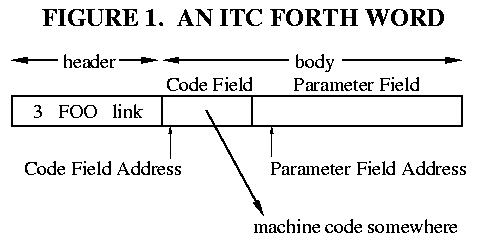

# MACHINE-CODE ACTIONS

ForthのCONSTANTは、おそらく機械語のアクションの最も単純な例です。フランス語圏の定数をいくつか考えてみましょう。
```
1 CONSTANT UN
2 CONSTANT DEUX
3 CONSTANT TROIS
```
UN を実行すると、Forth パラメータスタックに値 1 がプッシュされます。DEUX を実行すると、スタックに 2 をプッシュし、以下同様です。(パラメータスタックとパラメータフィールドを混同しないように、これらは全く別のものです)。

Forthカーネルには、CONSTANTというワードが1つあります。これは定数型のワードそのものではなく、Forthの上位定義である。CONSTANTは”定義ワード”であり、Forthの辞書に新しいワードを作成する。ここでは、UN、DEUX、TROISという新しい”定数型”ワードを作成しています。(この3つのワードは、CONSTANTの動作を行う機械語コード断片を指すコードフィールドを持ちます。

このコード片は何をしなければならないのでしょうか。図2は、定数3個のメモリ表現を示しています。3つのワードはすべて、共通のアクションルーチンを指しています。この場合、パラメータフィールドは定数値(オブジェクト用語で”インスタンス変数”)を保持するだけです。つまり、これらの3つのワードのアクションは、パラメータフィールドの内容をフェッチし、これをスタックにプッシュすることです。このコードでは、パラメータフィールドに1セルの値が含まれていることを暗黙のうちに理解しています。

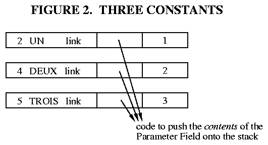

これを実現するための機械コード断片を書くには、Forth intereterが機械コードにジャンプした後、パラメータフィールドアドレスをどのように見つけるかを知る必要があります。つまり、PFAはどのようにして機械語ルーチンに渡されるのでしょうか? これは、ForthインタプリタのNEXTがどのようにコーディングされているかに依存し、実装によって異なる。機械語アクションを書くためには、NEXTを理解しなければならない。

ITCのNEXTは、第1回で擬似的に説明しました。ここでは、Y=IP、X=Wを使った6809用の実装を一つ紹介します。
```
NEXT:   LDX ,Y++    ; (IP) -> W, and IP+2 -> IP
        JMP [,X]    ; (W) -> temp, JMP (temp)
```
高レベルのスレッドにいると仮定すると
```
   ... swap deux + ...
```   
で、NEXTが実行されたとき、インタープリタ・ポインタ(IP)がDEUX”命令”を指しているとします。(図3はその様子を示しています。IP(レジスタY)は、高レベルスレッド内で、ForthワードDEUXのアドレスを含むメモリセルを指している。正確には、このセルはDEUXのコードフィールドアドレスを含んでいます。したがって、Yを使用してセルをフェッチし、Yをオートインクリメントすると、DEUXのコードフィールドアドレスをフェッチすることになる。これがW(レジスタX)に入るので、Wはコードフィールドを指すことになる。このフィールドの内容は、何らかの機械コードのアドレスです。このセルの内容をフェッチして、6809命令1つでマシンコードにジャンプすることができるのです。この場合、レジスタXは変更されないので、WはDEUXのCFAを指したままです。この場合、パラメータフィールドアドレスは、単純にコードフィールドを2バイト過ぎたところにあるので、こうして取得します。

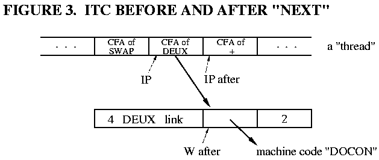

したがって、機械語コード断片は、Wに2を加え、そのアドレスのセル値を取り込み、スタックにプッシュするだけでよい。この断片はしばしば DOCON と呼ばれる。
```
DOCON:  LDD 2,X  ; fetch the cell at W+2
        PSHU D   ; push that on the Parameter Stack
        NEXT     ; (macro) do the next high-level word
```
(この例では、TOSはメモリに保持されている。) 前のNEXTでIPが2増加したので、DOCONがNEXTするとき、すでにスレッドの次のセル(”+のCFA”)を指していることに注意してください。

一般に、ITC ForthはWレジスタにパラメータフィールドアドレスまたは、その”近く”のアドレスを残しておきます。この場合、WはCFAを含んでおり、このForthの実装では常にPFA-2です。コードワード以外のForthワードのすべてのクラスは、パラメータフィールドアドレスを使用する必要があるので、NEXTの多くの実装では、PFAを指してそれを残すためにWをインクリメントしています。6809では、1つの小さな変更でこれを行うことができます。
```
NEXT:  LDX ,Y++     ; (IP) -> W, and IP+2 -> IP
       JMP [,X++]   ; (W) -> temp, JMP (temp), W+2 -> W
```
これは、NEXTに3クロックサイクルを追加し、パラメータフィールドアドレスをWに残します。
```
        W=CFA           W=PFA

DOCON:  LDD 2,X (6)     LDD ,X (5)
        PSHU D          PSHU D
        NEXT            NEXT

DOVAR:  LEAX 2,X (5)    ; no operation
        PSHU X          PSHU X
        NEXT            NEXT

ENTER:  PSHS Y          PSHS Y
        LEAY 2,X (5)    LEAY ,X  (4, faster than TFR X,Y)
        NEXT            NEXT
```
NEXTの3サイクルのペナルティと引き換えに、DOCONコードは1クロック、DOVARは5サイクル、ENTERは1サイクルが削減されます。コードワードはWの値を使用しないので、オートインクリメントから何も得られません。得られる速度または失われる速度は、実行されるForthワードの組み合わせによって決定されます。通常、実行されるワードのほとんどはコードワードであるため、NEXTでWをインクリメントすると、全体として速度が少し犠牲になります。(メモリの節約にもなりますが、DOCON、DOVAR、ENTERは一度しか登場しないので、この利益はわずかです)。

もちろん、最適な判断はプロセッサに依存します。Z80のようにバイト単位でメモリにアクセスし、オートインクリメントアドレスモードを持たないマシンでは、WをIP+1(コードフィールドから取り出した最後のバイト)を指すようにするのが最適な場合があります。他のマシンでは、オートインクリメントは”自由”であり、Wをパラメータフィールドを指すままにしておくのが最も便利である。

覚えておいてほしいのは、この決定は<u>一貫して</u>行われなければならないということです。NEXT が、Wが実行中のワードの PFA を指した状態のまま次に進むなら、EXECUTE も同じようにしなければならないということです(これは、この記事の冒頭で訂正した”OOPS”です)。

## Direct Threading

Direct ThreadingはIndirect Threadingと同じように動作しますが、コードフィールドに機械コードのアドレスが入るのではなく、機械コードへのJUMPまたはCALLが入る点が異なります。このため、コードフィールドは大きくなりますが(例えば6809では1バイト大きくなります)、NEXTルーチンから1レベルのインダイレクトが削除されます。

コードフィールドにJUMP命令とCALL命令のどちらを使用するかは、機械語ルーチンがどのようにパラメータフィールドアドレスを取得するかによります。コードフィールドにジャンプするために、多くのCPUはそのアドレスがレジスタにあることを必要とします。例えば、8086での間接ジャンプはJMP AX(または他のレジスタ)、Z80ではJP(HL)(またはIXまたはIY)です。これらのプロセッサでは、DTCのNEXTは2つの演算を含み、6809では次のようになります。
```
NEXT:  LDX ,Y++    ; (IP) -> W, and IP+2 -> IP
       JMP ,X      ; JMP (W)
```
(8086では、LODSW, JMP AXで可能です。) その効果を図4で”ケース1”として示します。DEUXのコードフィールドアドレスが上位スレッドからフェッチされ、IPがインクリメントされる。そして、フェッチではなく、コードフィールドアドレスにJUMPする(つまり、CPUがコードフィールドに直接ジャンプする)。CFAは、上記の最初のITCの例と同じようにWレジスタに残されています。このアドレスはすでにレジスタに入っているので、コードフィールドにDOCONへのJUMPを入れるだけで、DOCONフラグメントは以前と同じように機能します。

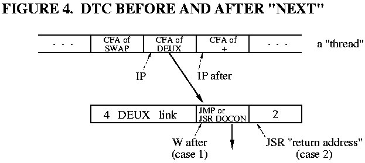

しかし、6809やPDP-11など一部のプロセッサでは、このDTC NEXTを1命令で実行することができます。

NEXT  JMP [,Y++] ; (IP) -> temp, IP+2 -> IP, JMP (temp)
これも、CPUはDEUXのコードフィールドにジャンプします。しかし、一つ大きな違いがあります。CFAはどのレジスタにも残されていないのです! では、機械語コード断片はどのようにしてパラメータフィールドアドレスを見つけるのでしょうか? JUMPの代わりにCALL(JSR)をコードフィールドに入れることによってです。ほとんどのCPUでは、CALL命令はリターンアドレス(CALL命令の直後のアドレス)をリターンスタックにプッシュします。図4が示すように(”ケース2”)、このリターン・アドレスはまさに私たちが欲しいパラメータフィールド・アドレスです。したがって、DOCONは、リターンスタックをポップして、コードフィールドのJSRをバランスさせ、そのアドレスを使って定数値を取り出すだけでよいのです。このように
```
DOCON:  PULS X   ; pop the PFA from the Return Stack
        LDD ,X   ; fetch the Parameter Field cell
        PSHU D   ; push that on the Parameter Stack
        NEXT     ; (macro) do the next high-level word
```
これをITC版と比較する。DOCONに1命令追加されましたが、NEXTから1命令削除されました。DOVARとNEXTも同様に1命令分長くなっています。
```
DOVAR:  PULS X   ; pop the PFA of the word
        PSHU X   ; push that address on the Parameter Stack
        NEXT

ENTER:  PULS X   ; pop the PFA of the word
        PSHS Y   ; push the old IP
        TFR X,Y  ; the PFA becomes the new IP
        NEXT
```
さて、この記事の最初に戻って、私の”OOPS”を読み直して、なぜIPを使ってCFAを再取得することができないかを見てください。また、Forthのスタックポインタの6809のUとSへの割り当てが逆になっている場合の違いにも注目してください。

## Subroutine Threading

サブルーチンスレッディング(STC)は、CPUがForthワードのコードフィールドに直接ジャンプする点で、DTCと似ています。ただ今はNEXTコードもIPレジスタもWレジスタもありません。そこで、パラメータフィールド Addressを取得するためには、コードフィールドでJSRを使用するしかありません。この処理を図5に示します。

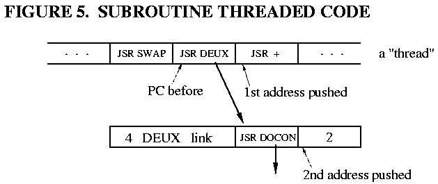

上位の”スレッド”は、CPUが実行する一連のサブルーチンコールである。JSR DEUXが実行されると、スレッド内の次の命令のアドレスがリターンスタックにプッシュされる。次に、DEUXの中のJSR DOCONを実行すると、DEUXのPFAである別のリターンアドレスがリターンスタックにプッシュされる。DOCON は、そのアドレスをポップして、定数をフェッチし、定数をスタックし、RTS を実行してスレッドに戻るために使用することができます。
```
DOCON:  PULS X  ; pop the PFA from the Return Stack
        LDD ,X  ; fetch the Parameter Field cell
        PSHU D  ; push that on the Parameter Stack
        RTS     ; do the next high-level word
```
サブルーチン・スレッド・コードでも、コードフィールドとパラメータフィールドについて話すことができます。コードとコロン定義以外のすべての”クラス”のForthワードでは、コードフィールドはJSRまたはCALL命令が占めるスペース(DTCと同じ)であり、パラメータフィールドはその後に続くものです。つまり、6809の場合、PFAはCFA+3に相当します。コードやコロンの定義では、”パラメータフィールド”の意味がやや曖昧になりますが、それは今後の記事で見ていくことにしましょう。

# THE SPECIAL CASE: CODE WORDS

上記の一般論には、重大な例外があります。これはコード定義、つまり機械コードのサブルーチンとして定義されたForthのワードです。Forthの各ワードは機械コードの一部を実行するので、この素晴らしい機能はForthに簡単に実装することができます。

コードワードを構成する機械語は、常にForthワードの本体に含まれています。間接スレッドのForthでは、コードフィールドには実行される機械コードのアドレスが含まれていなければなりません。そこで、図6に示すように、機械語はパラメータフィールドに配置され、コードフィールドにはパラメータフィールドのアドレスが含まれます。

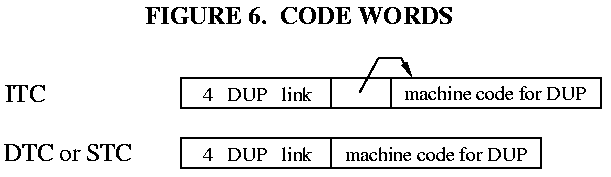

ダイレクトスレッドやサブルーチンスレッドの Forth では、コードフィールドにパラメータフィールドへのジャンプを入れてもよいと考えるかもしれません。しかし、パラメータフィールドはコードフィールドの直後にあるため、これは無意味なことです。コードフィールドをNOPで埋めても同じ結果になります。良い方法は、機械語コードをコードフィールドから開始し、そのままパラメータフィールドになだれ込むことです。この時点で”コードフィールド”と”パラメータフィールド”の区別がなくなります。コードワードにはこの区別は必要ないので、問題ありません(デコンパイラやある種の巧妙なプログラム技法には影響がありますが、ここでは関係ありません)。

コードワードは、どのような実装であれ、機械語の”アクション”ルーチンがパラメータフィールドのアドレスを渡される必要のない唯一のケースです。パラメータフィールドは、データではなく、実行されるコードを含んでいるのです。NEXTだけがこのアドレス(またはコードフィールドアドレス)を知る必要があり、機械語コードにジャンプすることができます。

# USING ;CODE

3つの疑問が残っています。

a. パラメータフィールドに任意のデータを持つ新しいForthワードをどのように作成するか? 

b. そのワードのコードフィールドをどのように変更して、私たちが選んだ機械コードを指すようにするのか? 

c. この機械コードの断片は、それを使用するワードから分離して存在しますが、どのようにコンパイル(アセンブル)するのでしょうか? 

a)の答えは、これを行うためにForthのワードを書くということです。このワードは、実行されるとForth辞書に新しいワードを定義(作成)するので、"定義ワード" と呼ばれます。CONSTANTは定義ワードの一例です。定義ワードの”大変な仕事”はすべてカーネルワードのCREATEが行います。CREATEは入力ストリームから名前をパースし、新しいワードのヘッダとコードフィールドを構築し、辞書にリンクします(fig-Forthでは、このワードは`<BUILDS`と呼ばれています)。 プログラマに残されたのは、パラメータフィールドを構築することだけです。

(b)と(c)に対する答えは、それぞれ(;CODE)と;CODEという2つの複雑な言葉で具現化されています。その仕組みを理解するために、ForthでCONSTANTという定義ワードが実際にどのように書かれているかを見てみましょう。オリジナルのITC 6809の例を使って。

```
: CONSTANT ( n -- )
    CREATE      \ create the new word
    ,           \ append the TOS value to the dictionary,
                \   as the 1st cell of the Parameter Field
    ;CODE       \ end high-level & start assembler code
    LDD 2,X     \ the code fragment DOCON
    PSHU D      \  "   "      "       "
    NEXT        \  "   "      "       "
END-CODE
```
このForthのワードには2つの部分があります。**`: CONSTANT`** から **`;CODE`** までのすべてが、`CONSTANT`というワードを呼び出したときに実行される高レベルのForthコードです。`CONSTANT`から`END-CODE`までは、`CONSTANT`の”子”である`UN`や`DEUX`などの”定数クラス”ワードが実行されたときに実行されるマシンコードです。つまり、`;CODE`から`END-CODE`までは、定数型ワードが指し示すコードの断片です。`;CODE`という名前は、高レベルの定義(";")を終了し、マシンコードの定義("CODE")を開始することを意味します。しかし、これは2つの別々のワードとして辞書に登録されることはありません。`: CONSTANT`から`END-COD`までの全てが、図7に示すように、CONSTANTのパラメータフィールドに含まれます。

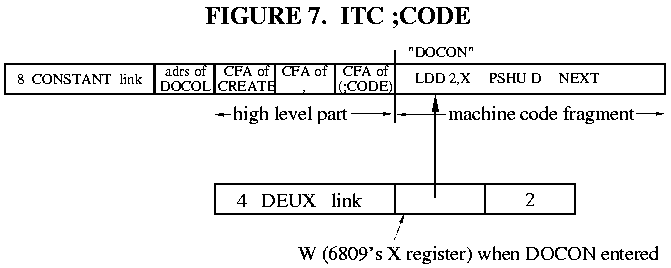

Derick and Baker [DER82]は、ワードを定義する動作を理解するのに役立つ3つの”シーケンス”を挙げています。

シーケンス1は、CONSTANTというワードが定義されているときです。これは、高レベルのコンパイラ(最初の部分)とForthアセンブラ(2番目の部分)の両方が関与しています。このとき、図7に示すCONSTANTの定義が辞書に追加されています。後述するように、シーケンス1ではコンパイラディレクティブである;CODEが実行されます。

シーケンス2は、CONSTANTというワードが実行されているときと、何らかの定数型ワードが定義されているときです。この例では
```
2 CONSTANT DEUX
```
シーケンス2は、CONSTANTが実行され、DEUXが辞書に追加されるときです(図7参照)。シーケンス2では、CONSTANTの上位部分(;CODE)を含めて実行されます。

シーケンス3は、定数型ワードが実行されるときです。この例では、シーケンス3は、値2をスタックにプッシュするためにDEUXが実行されるときです。これはCONSTANTのマシンコード部分が実行されるときです(この断片は、DEUXのコードフィールドの動作であることを思い出してください)。

`;CODE`と`(;CODE)`というワードは、次のような働きを行います。

;CODEは、CONSTANTがコンパイルされるシーケンス1の間に実行されます。これはForth IMMEDIATEワードの例で、Forthのコンパイル中に実行されるワードです。

a. Forthのワード(;CODE)をCONSTANTにコンパイルする。  
b. Forthコンパイラをオフにする。  
c. Forthアセンブラをオンにする。  

(;CODE)はCONSTANTの一部なので、CONSTANTが実行されたときに実行されます(シーケンス.2)。これは、以下の動作を行います。

a. 直後に続くマシンコードのアドレスを取得します。これは、ForthのリターンスタックからIPをポップすることによって行われます。

b. そのアドレスをCREATEで定義されたワードのコードフィールドに入れる。ForthワードのLAST(時にはLATEST)は、そのワードのアドレスを取得します。

c. Forth内部インタプリタがForthスレッドの一部として続く機械語を実行しようとしないように、EXIT(別名 ;S)の動作をします。これは、Forthスレッドを終了させる高レベルの”サブルーチン・リターン”です。

F83[LAX84]は、これらがForthで一般的にどのようにコード化されるかを示しています。
```
: ;CODE
    COMPILE (;CODE)     \ compiles (;CODE) into definition
    ?CSP  [COMPILE] [   \ turns off the Forth compiler
    REVEAL              \   (just like ";" does)
    ASSEMBLER           \ turns on the assembler
    ; IMMEDIATE         \ this is an IMMEDIATE word!

: (;CODE)
    R>                  \ pops the adrs of the machine code
    LAST @ NAME>        \ gets the CFA of the latest word
    !                   \ stores the code address in the
    ;                   \   Code Field
```

(;CODE)は、この2つのうちより微妙なものです。これは高レベルのForth定義なので、CONSTANTスレッドでそれに続くアドレス(高レベルの”リターンアドレス”)は、Forthのリターンスタックにプッシュされます。したがって、(;CODE)内でリターンスタックをポップすると、その後に続くマシンコードのアドレスが得られます。また、リターンスタックからこの値をポップすると、高レベルのサブルーチンのリターンを1レベル”バイパス”するので、(;CODE)が終了するときに、CONSTANTの呼び出し元に対して終了することになります。これは、CONSTANTに戻り、CONSTANTがすぐに戻るのと同じです。図7を使い、CONSTANTと(;CODE)のワードの実行を歩いて、これがどのように機能するかを見てください。

## Direct and Subroutine Threading

DTCとSTCの場合、;CODEと(;CODE)の動作はITCと同じですが、重要な例外が1つあります：コードフィールドはアドレスを保持する代わりに、JUMPまたはCALL命令を保持します。絶対的なJUMPまたはCALLの場合、おそらく唯一の違いは、アドレスがJUMPまたはCALL命令のオペランドとして、コードフィールドの最後に格納されなければならないことです。6809の場合、アドレスは3バイトのJSR命令の最後の2バイトとして格納されます。しかし、8086のPygmy Forthなど一部のForthは、コードフィールドで相対ブランチを使用します。この場合、相対オフセットを計算し、分岐命令に挿入する必要があります。

# HIGH-LEVEL FORTH ACTIONS

これまで、Forthのワードに機械語コードの選択された断片を実行させる方法と、その断片にワードのパラメータフィールドのアドレスを渡す方法について見てきました。しかし、高レベルのForthで”アクションルーチン”をどのように書けばいいのでしょうか? 

Forthの各ワードは、NEXTの動作によって、何らかの機械語ルーチンを実行しなければなりません。これがコードフィールドの役割です。したがって、高レベルのアクションを呼び出す際の問題を処理するために、機械語ルーチン、またはルーチンのセットが必要です。このルーチンをDODOESと呼ぶことにする。解決すべき問題は3つです。

a. このForthワードに関連する高レベルのアクションルーチンのアドレスをどのように見つけるか? 

b. 機械語から、高レベルのアクションルーチンのためにForthインタープリタを呼び出すにはどうしたらよいか? 

c. 実行中のワードのパラメータフィールドのアドレスを、どのようにそのルーチンに渡すか? 

(c)の答え、つまり高レベルのForthルーチンにどうやって引数を渡すかは簡単です。もちろん、Parameter Stack上です。機械語ルーチンは、高レベルルーチンを呼び出す前に、パラメータフィールドアドレスをスタックにプッシュしておかなければなりません。(前回の作業で、機械語ルーチンがどのようにPFAを得ることができるかを知っています)。

(b)の答えは、少し難しいです。基本的には、Forthのワードを呼び出すEXECUTEや、コロンの定義を呼び出すENTERのようなことを行いたいのです。どちらも”重要な”カーネル・ワードです。DODOESのコードは、これらに似ていることでしょう。

問題(a)は、厄介な問題です。高レベルルーチンのアドレスはどこに置くのでしょうか? コードフィールドは高級コードを指すのではなく、機械語コードを指す必要があることを忘れないでください。過去に2つのアプローチが使われてきました。

1. fig-Forthの解決策。Fig-Forthは、パラメータフィールドの最初のセルを、高レベルコードのアドレスを保持するために予約しました。そして、DODOESルーチンはパラメータフィールドのアドレスを取得し、実際のデータ(通常はPFA+2)のアドレスをスタックにプッシュし、上位ルーチンのアドレスをフェッチし、EXECUTEを実行します。

この方法には、2つの問題がありました。1つは、パラメータフィールドの構造が、マシンコードのアクションと上位のアクションで異なっていたことです。例えば、マシン”アクションで定義されたCONSTANTは、そのデータがPFAに格納されますが、高レベル・アクションで定義されたCONSTANTは、そのデータが(通常)PFA+2に格納されます。

第二に、高レベルアクションクラスの各インスタンスは、1セルの追加オーバーヘッドを伴っていました。つまり、CONSTANTが高レベルアクションを使用する場合、プログラム内で定義されるすべての定数が1セル大きくなってしまうのです!

幸いなことに、賢いForthプログラマたちは、これらの問題を克服する解決策をすぐに考案し、fig-Forth方式は使われなくなりました。

2. 現代の解決策 現在、ほとんどのForthは、高レベルのアクションルーチンごとに異なる機械語断片を関連付けています。つまり、定数は、そのコードフィールドが、CONSTANTという高レベルのアクションを呼び出すことだけを目的とした機械語断片を指していることになります。高レベル変数のコードフィールドは、高レベルVARIABLEアクションの”スタートアップ”ルーチンを指し、以下同様です。

これは過剰なコードの重複でしょうか? いいえ、これらの機械語の断片は、それぞれ共通の起動ルーチンであるDODOESへのサブルーチン呼び出しに過ぎないからです。(DODOESへの高レベルコードのアドレスは、"インライン" サブルーチン・パラメータとして渡されます。つまり、JSR/CALL命令の直後に高レベルコードのアドレスが置かれる。DODOESは、このアドレスを取得するために、CPUスタックをポップしてフェッチすることができます。

実際には、さらに2つの簡略化を行います。JSR/CALL命令の直後に上位コードそのものを置きます。そして、DODOESはCPUのスタックをポップして、このアドレスを直接取得します。そして、これはForthの上位コードであることが分かっているので、コードフィールドを省いて、上位スレッドだけをコンパイルする・・・つまり、ENTERの動作をDODOESに取り込むのです。

これで、各”定義済み”ワードは、機械コードのビットを指すだけとなり、そのパラメータフィールドにはスペースが消費されません。この機械コードのビットは、JSRまたはCALL命令で、その後に高レベルのアクションルーチンが続きます。6809の例では、すべての定数の2バイトと、1度だけ登場する3バイトのJSRを交換したことになります。

これは間違いなく、Forthカーネル全体の中で最も複雑なプログラム・ロジックです では、実際にどのように実装されているのか、頼みの綱のITC 6809の例で見てみましょう。

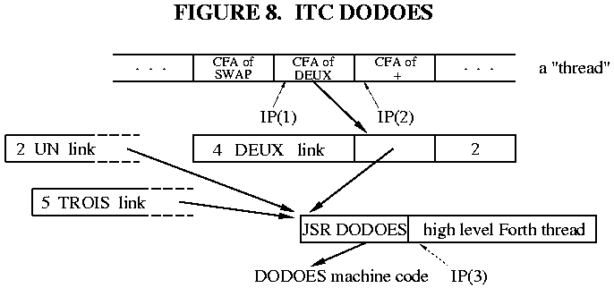

図8は、定数DEUXを高水準のアクションで実装したものです。ForthインタープリタがDEUXに遭遇したとき、つまりForth IPがIP(1)にあるとき、DEUXのコードフィールドに含まれるアドレスをフェッチし、そのアドレスにジャンプするという通常の動作を行います。そのアドレスにはJSR DODOES命令があるので、すぐに2回目のジャンプ(今回はサブルーチンコール)が行われます。そして、DODOESは以下の動作を行う必要があります。

a. DEUXのパラメータフィールドのアドレスをパラメータスタックにプッシュし、高レベルのアクションルーチンが後で使用できるようにします。JSR命令はレジスタを変更しないので、DEUXのパラメータフィールドアドレス(または”近い”アドレス)がWレジスタに残っていると予想されます。

b. CPUスタックをポップして、高レベルのアクションルーチンのアドレスを取得します。(CPUスタックをポップすると、JSR命令の直後にあるもののアドレスが得られることを思い出してください)。これは上位スレッド、すなわちコロン定義のパラメータフィールド部分です。

c. Forthの命令ポインタの古い値、IP(2)をForthのリターンスタックに保存します。基本的に、DODOESはENTERと同じようにIPを”ネスト”しなければなりません。ForthのReturn StackはCPUのサブルーチンスタックと同じとは限らないことを忘れないでください。

d. 上位スレッドのアドレスをIPに入れる。これは図8のIP(3)です。

e. 新しい場所で高レベルの解釈を継続するためにNEXTを実行します。

間接スレッドのITC6809を想定し、以下のようにします。

* WはNEXTでインクリメントされません(すなわち、WにはNEXTで入力されたワードのCFAが格納されます)。

* 6809のSはForthのPSP、UはForthのRSPです(つまり、CPUスタックはForthのリターンスタックではありません)。

* 6809のYはForthのIPで、XはForthのWです。

これらの条件に対するNEXTの定義を思い出してください。
```
NEXT:  LDX ,Y++   ; (IP) -> W, and IP+2 -> IP
       JMP [,X]   ; (W) -> temp, JMP (temp)
```

DODOES can be written as follows:
```
DODOES: LEAX 2,X    ; make W point to the Parameter Field
        PSHU Y      ; (c) push old IP onto the Return Stack
        PULS Y      ; (b,d) pop new IP from the CPU stack
        PSHS X      ; (a) push W (the Parameter Field 
                    ;     Address) onto the Parameter Stack
        NEXT        ; (e) invoke high-level interpreter
```
これらの操作は、少し順番がずれています。正しいものが正しいタイミングで正しいスタックに(または正しいレジスタに)入る限り、操作の正確な順序は重要ではありません。この場合、新しいIPがCPUスタックからポップされる前に、古いIPがForthのリターンスタックにプッシュされるという事実を利用しています。

プロセッサによっては、CPUスタックがForthのリターンスタックとして使用されることがあります。この場合、一時的なストレージを含む1つのステップが必要です。上記でS=RSPとU=PSPを選択した場合、DODOESは次のようになります。
```
DODOES: LEAX 2,X    ; make W point to the Parameter Field
        PSHU X      ; (a) push W (the Parameter Field 
                    ;     Address) onto the Parameter Stack
        PULS X      ; (b) pop thread address from CPU stack
        PSHS Y      ; (c) push old IP onto the Return Stack
        TFR X,Y     ; (d) put thread address into IP
        NEXT        ; (e) invoke high-level interpreter
```
基本的にReturn/CPUスタックの先頭をIPと入れ替えているので、Xを一時的な保持レジスタとして使用する必要があります。したがって、Xレジスタを再使用する前に、PFAをプッシュしなければなりません(ステップ(a))。

これらのDODOESの例題を一歩ずつ歩いて、レジスタと2つのスタックの内容を追跡してください。私はいつもDODOESルーチンを歩いて、間違ったタイミングでレジスタを破壊していないことを確認します。

## Direct Threading(ダイレクト・スレッディング)

DODOESのロジックは、DTC Forthsでも同じです。しかし、DTC ForthがワードのコードフィールドでJMPを使うかCALLを使うかによって、実装が異なる場合があります。

a. コードフィールドのJMP。DTC Forthは、実行されるワードのアドレスがレジスタにある場合、コードフィールドでJMPを使用することができます。これは、ほとんどの場合、コードフィールド・アドレスになります。

DODOESの観点からは、これはITCと同じです。この例では、DODOESはForthインタープリタがDEUXに関連するマシンコードにジャンプし、そのコードがDODOESへのJSRであることを見抜きます。最初のジャンプが間接ジャンプではなく直接ジャンプになったことは問題ではなく、レジスタとスタックの内容は同じです。つまり、DODOESのコードはITCのコードと同じになります(もちろん、NEXTは違いますし、Wはパラメータフィールドを指すために別のオフセットが必要かもしれません)。

b. コードフィールドのCALL/JSR。DTC6809では、実行されるワードのCFAを明示的に取り出すことはないので、ForthワードはそのコードフィールドにJSRを含まなければなりません。Forthワードのパラメータフィールドアドレスをレジスタで見つけるのではなく、CPUスタック上で見つけます。

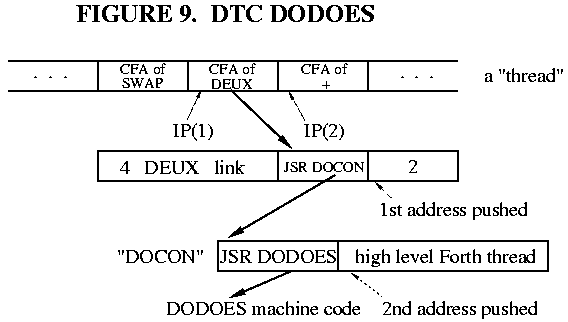

この場合のDEUXの例は、図9に示すとおりです。ForthのIPがIP(1)のとき、ForthインタープリタはDEUXのコードフィールドにジャンプします(IPもインクリメントされます)。コードフィールドには、DEUXの機械語コードフラグメントへのJSRがあります。そのアドレスには、DODOESへの2つ目のJSRがあります。つまり、2つのものがCPUスタックにプッシュされるわけです。最初のJSRのリターンアドレスは、DEUXのパラメータフィールドアドレスです。2番目のJSRのリターンアドレス、つまりCPUスタックの一番上のアドレスは、実行される高レベルのスレッドのアドレスです。DODOESは、古いIPがリターンスタックにプッシュされ、DEUXのPFAがパラメータスタックにプッシュされ、高レベルのスレッドのアドレスがIPにロードされるようにしなければなりません。これは、スタック割り当てに非常に敏感です S=PSP(CPUスタック)、U=RSPの場合、NEXTとDODOESのコードは以下のようになります。
```
NEXT: LDX [,Y++] ; (IP) -> temp, IP+2 -> IP, JMP (temp)

DODOES: PSHU Y  ; push old IP onto the Return Stack
        PULS Y  ; pop new IP from the CPU stack
                ; note: the CPU stack is the Parameter Stack, and the
                ; topmost element is now the PFA of the word...
                ; exactly what we want! 
        NEXT    ; invoke high-level interpreter
```
NEXT、DEUX、DODOESの流れは、正味1つのアイテム(DEUXのPFA)をパラメータスタックにプッシュしていることを自分で確認してください

## Subroutine Threading

STC Forthsでは、IPやWレジスタは存在せず、高レベルの”スレッド”は純粋なマシンコード(一連のサブルーチンコール)です。高レベルアクションと ;CODEアクションの唯一の違いは、”定義済み”ワードのPFAがパラメータスタックにプッシュされなければならないことです。"定義済み" ワードはコードフィールドにCALL/JSRを持ち、CPUスタックはForthのリターンスタックでなければならないので、DODOESはほとんどスタック操作の問題です。

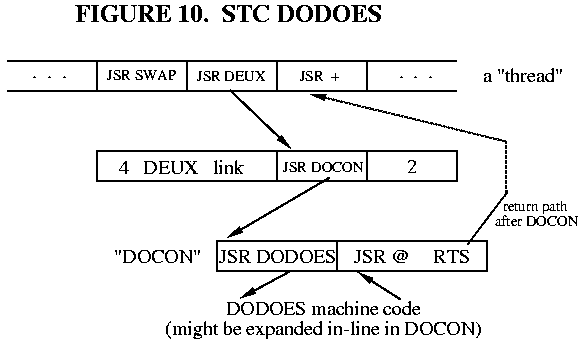

図10は、高レベルのアクションを持つDEUXの6809 STCの例です。DODOESが入力されるまでに、”メイン”スレッドのリターンアドレス、DEUXのPFA、DEUXの高レベルアクションコードのアドレスの3つがCPU/リターンスタックにプッシュされています。DODOESは、最後の2つをポップし、PFAをパラメータスタックにプッシュし、アクションコードにジャンプしなければなりません。
```
DODOES: PULS X,Y    ; action code adrs -> X, PFA -> Y
        PSHU Y      ; push PFA onto Parameter Stack
        JMP ,X      ; jump to the action code
```
6809用のDODOESは3命令ルーチンになりました。JSR DODOESを”インライン展開”する、つまりJSR DODOESを同等のマシンコード命令に置き換えることで、さらに簡素化することができます。JSRが1つ減るので、スタック操作は次のように単純化されます。
```
        PULS X      ; pop PFA from CPU stack
        PSHU X      ; and push it onto the Parameter Stack
        ...high level thread for DEUX...
```
これは、3バイトのJSRを4バイトの明示的なコードで置き換えるもので、かなりの速度向上が期待できます。6809の場合、これはおそらく良い選択でしょう。8051のようなプロセッサでは、DODOESは十分に長いので、サブルーチンとして維持されるべきです。

# USING DOES>

パラメータフィールドに任意のデータを持つ新しいForthワードを作成する方法と、そのワードのコードフィールドに新しいマシンコードの断片を指定させる方法を;CODEで学びました。高レベルのアクションルーチンをコンパイルして、新しいワードを指し示すにはどうしたらよいのでしょうか。

その答えは、`DOES>` と(`DOES>` )という2つのワードにあります。これは、高レベルの;CODEと(;CODE)に相当します。これらを理解するために、その使用例を見てみましょう。
```
: CONSTANT ( n -- )
    CREATE      \ create the new word
    ,           \ append the TOS value to the dictionary,
                \   as the 1st cell of the Parameter Field
    DOES>       \ end "create" part & start "action" part
    @           \ given the PFA, fetch its contents
    ;
```
先ほどの;CODEの例と比較すると、`DOES>` が;CODEと同じような機能を果たしていることがわかります。このように、: CONSTANTから`DOES>` までのすべてが、CONSTANTというワードが呼び出されたときに実行される。これは、”定義された”ワードのパラメータフィールドを構築するコードである。`DOES>` から;までは、CONSTANTの”子”(DEUXなど)が呼び出されたときに実行される高レベルのコード、つまり、コードフィールドが指す高レベルのフラグメントです。(図11に示すように、;CODEと同様に、”create”句と”action”句の両方がForthワードCONSTANTのボディに含まれる。

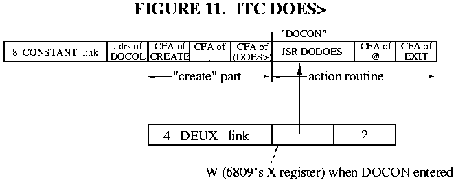

Sequence 1, 2, 3 を思い出してください。`DOES>` と(`DOES>` )というワードは次のような働きをします。

`DOES>`はシーケンス1において、CONSTANTがコンパイルされたときに実行されます。したがって、`DOES>` はForthのIMMEDIATEワードである。それは2つのことをする。

a. a. Forthワード(`DOES>` )をCONSTANTにコンパイルする。
b. b. JSR DODOESをCONSTANTにコンパイルする。

`DOES>` は、その後に続く高レベルのフラグメントをコンパイルするために、Forthコンパイラを実行したままにしていることに注意してください。また、JSR DODOESはそれ自体がForthコードではないにもかかわらず、`DOES>` のようなIMMEDIATEワードにより、Forthコードの途中でコンパイルされることがあります。

(`DOES>` )はCONSTANTというワードの一部なので、CONSTANTが実行されるときに実行されます(シーケンス2)。それは、次のようなことを行います。

a. ForthのリターンスタックからIPをポップして、直後の機械語コード(JSR DODOES)のアドレスを取得する。

b. b. そのアドレスをCREATEで定義したワードのコードフィールドに入れる。

c. c. EXITの動作を行い、CONSTANTをここで終了させ、その後に続くフラグメントの実行を試みないようにする。

(`DOES>` )の動作は、(;CODE)と同じです! 別のワードは、厳密には必要ではありません。例えばF83では、;CODEと`DOES>` の両方で(;CODE)を使用しています。これからは(`DOES>` )の代わりに(;CODE)を使うことにします。

(;CODE)の仕組みはもうおわかりですね。`DOES>` のF83の定義は次の通りです。
```
: DOES>
    COMPILE (;CODE)     \ compiles (;CODE) into definition
    0E8 C,              \ the CALL opcode byte
    DODOES HERE 2+ - ,  \ the relative offset to DODOES
    ; IMMEDIATE
```
ここで、DODOESはDODOESルーチンのアドレスを保持する定数です。(実際のF83のソースコードは、F83のメタコンパイラの要求により、若干異なります)。DOES＞は、Forthコンパイラが "on" のままなので、CSPやスマッジビットをいじる必要はない。8086の場合、CALL命令は相対アドレスが必要です。6809の場合、`DOES>` は次のようになります。
```
: DOES>
    COMPILE (;CODE)     \ compiles (;CODE) into definition
    0BD C,              \ the JSR Extended opcode byte
    DODOES ,            \ the operand: address of DODOES 
    ; IMMEDIATE
```
機械語の JSR DODOES が高レベル (;CODE) の後、高レベルの "action" コードの前にコンパイルされていることがわかります。

## Direct and Subroutine Threading

DTCとSTCの唯一の違いは、コードフィールドが新しいルーチンを指し示すようにいじられる方法です。これは(;CODE)によって行われ、必要な変更はすでに説明したとおりです。`DOES>` は、STC Forthを書いていて、JSR DODOESを明示的なマシンコードに拡張しない限り、全く影響を受けません。この場合、`DOES>` はJSR DODOES命令の代わりに”インライン”マシンコードをアセンブルするよう変更されます。

# ONWARD AND UPWARD

これほど少ない行数のコードで、これほど多くの説明が必要になるとは、誰が想像したでしょうか? これほどまでに複雑で、強力で、柔軟な構成が経済的にコード化されているのを見たことがなかったからです。

次回は、アセンブラとメタコンパイラの利点について説明し、Forthのサンプルシステムの実際のコード定義を提供します。

# REFERENCES
[DER82] Derick, Mitch and Baker, Linda, Forth Encyclopedia, Mountain View Press (1982). A word-by-word description of fig- Forth in minute detail. Still available from the Forth Interest Group, P.O. Box 2154, Oakland CA 94621.

[LAX84] Laxen, H. and Perry, M., F83 for the IBM PC, version 2.1.0 (1984). Distributed by the authors, available from the Forth Interest Group or GEnie.

Author's note for web publication: the files formerly available on the GEnie online service are now available from the Forth Interest Group FTP server, ftp://ftp.forth.org/pub/Forth.
