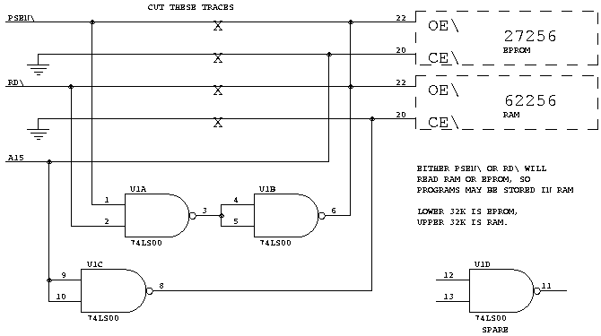

# Part 7: CamelForth for the 8051

> This article first appeared in The Computer Journal #71 (January/February 1995).

尊敬する編集者の助言に従い、8051用のCamelForthを紹介します。6809用のCamelForthも近日公開予定です。この8051 Forthは、約6Kのプログラム・メモリを占有しています。残念ながら、完全なソースリストはTCJの16ページを占めてしまうので、この記事ではカーネルの大きく変更された部分のみを紹介します。[**Web公開用の注意：8051のソースコードへのリンクはこのページの最後を参照してください**] 。これらは、8051アセンブラやサブルーチンのスレッディングのために高レベルのコードがどのように変更されるかを説明するものです。ソースコードの全文は GEnie の Forth Roundtable に CAMEL51.ZIP というファイルとして、フリーウェアの 8051 アセンブラは A51.ZIP というファイルとして置いてあります。その前に...

# Z80 ERRATA
ファイル CAMEL80H.AZM では、DO の定義は次のようになっています。
```
  ['] xdo ,BRANCH .... 
```
となっていますが、これは
```
  ['] xdo ,XT ....
```
でなければなりません。この誤りは、Z80では(,BRANCHと,XTが同じなので)表面化しませんでしたが、8051では恥ずかしくなるほど明白になってしまいました。

また、`S"`と(S")の中で、ALIGNというワードは、本当はALIGNEDであるべきでした。Z80では(8051でも)どちらもno-opなので、この間違いは表面化しませんでした。

# 8051 CAMELFORTH MODEL

第60号(本書Part 2)で、8051 Forthの設計上の決定事項をまとめました。要約すると、8051のよろしくないメモリアドレッシングは、実質的にサブルーチンスレッドを使用することを要求しています。つまり、(8051のレジスタ・ファイルにある)ハードウェア・スタックをリターンスタックとします。パラメータスタック(別名データスタック)は256バイトの外部RAMにあり、R0をスタックポインタとして使用します。その記事を書いた後に、TOS(Top Of Stack item)はR3:R2よりもDPTRに置いた方が良いことがわかりました。つまり、以下の表になります。

|reg adrs|8051 name|Forth usage|
|:------|:--------|:----------|
0|R0|PSP(パラメータスタックポインタ)の下位バイト
1-5|R1-R5|Forth用スクラッチレジスタ
6-7|R6-R7|ループ・インデックス
8||PSPの上位バイトとUP(P2にも出力)
9-7Fh||リターンスタックの119バイト(8052はもっとたくさんある!)
81h|SP|RSP(リターンスタックポインタ)の下位バイト
82-83h|DPTR|Top-Of-Stackアイテム
E0,F0h|A,B|Forth用スクラッチ・レジスタ

これは、Charles Curley [CUR93]のアイデアを取り入れたものです。8051 のようなレジスタが豊富なマシンでは、ループの最内部のインデックスをレジスタに保持することができます。これにより、LOOP と +LOOP はより高速になります。DO はまだ 2 つの値をリターンスタックにプッシュする必要があります： 古いループインデックスと新しいループリミットです! UNLOOP はもちろん、ループインデックスを復元しなければなりません。UNLOOPはもちろん、リターンスタックからループインデックスをリストアしなければなりません。R6:R7はリターンスタックの最上位ではなく、単に最内周のループインデックスであることに注意してください。

ポート2(P2)には、パラメータスタックポインタの上位バイト(R0が外部メモリをアドレス指定できるようにする)が入っており、これはユーザポインタの上位バイトでもある(UPの下位バイトは00と仮定される)。私は、外部ROMからの実行中にP2が読めないことを苦労して学びましたので、P2バイトのコピーをレジスタ8に保持するようにしています。

私は、BRANCHと?BRANCHの実装を新たに書き起こしました。8051のモデルはサブルーチンスレッドなので、高レベルのForthは真の機械語としてコンパイルされます。そのため、BRANCHはSJMP(またはAJMPやLJMP)命令で実装することができます。また、スタックトップの0/非0の状態をアキュムレータ(Aレジスタ)に格納すれば、JZ命令で?BRANCHを実装することができます。これはサブルーチンZEROSENSEが行います。つまり、BRANCHと?BRANCHは、次のようになります。
```
BRANCH:   SJMP dest 
?BRANCH:  LCALL ZEROSENSE JZ dest 
```
同様のルーチン LOOPSENSE と PLUSLOOPSENSE では、JZ 命令を LOOP と +LOOP に使用することができます。これらのルーチンでは、UNLOOPの呼び出しはJZの後に置く必要があります。プログラムがループから"脱落"したときにリターンスタックをクリーンアップするために。

アセンブリ言語のソースファイルでは、次のシーケンス
```
  LCALL word   RET
 ```
を、より短くて高速な
```
  LJMP word 
```
に手動で置き換えています[CUR93]。これは、word がリターンスタック演算子(R> や >R など)でない限り有効です。LCALL と LJMP も可能な限り ACALL と AJMP に置き換えられています。CamelForthコンパイラは、これらの最適化を試みません。

私は、8051カーネルを"インテル"のバイトオーダー(ローバイトが先)を使うように書きました。ところが、LJMPやLCALLにコンパイルされたアドレスは、上位バイト先行で格納されることがわかりました。カーネル全体を書き直すのではなく、LCALLをコンパイルするワードの中にバイトスワップを入れました。COMPILE、!CF、,CF(すべてDependencyワードセット内)です。

リスト1が8051アセンブリ言語の"プリミティブ"、リスト2がDependencyのワードセットです。

# HARVARD ARCHITECTURES

8051は"ハーバード"アーキテクチャを採用しており、プログラムとデータは別々のメモリに保存されます。組込みシステムでは、それぞれROMとRAMが一般的です。ANS Forthは、ハーバード・アーキテクチャの制限に対処した最初のForth規格です。簡単に説明すると、ANS Forthでは、a)アプリケーションプログラムはDataメモリにしかアクセスできない、b)メモリへのアクセスやデータ構造の構築に使用する演算子はすべてData空間で操作しなければならない、とされています。(ANS文書[ANS94]の3.3.3項参照)これには、以下のForthワードが含まれます。

@ ! C@ C! DP HERE ALLOT , C, COUNT TYPE WORD (S") S" CMOVE

しかし、Forthコンパイラは依然としてProgram空間(Code空間またはInstruction空間とも呼ばれる)にアクセスする必要があります。また、Forthはデータ空間だけでなく、プログラム空間の辞書ポインタを保持する必要があります。そこで、以下のような新しいワードを追加しました(リスト3参照)。


I@ I! IC@ IC! IDP IHERE IALLOT I, IC, ICOUNT ITYPE IWORD (IS") IS" D->I I->D

"I" は "Instruction" を意味する("P" と "C" はForthでは別の意味を持つため)。ICOUNTとITYPEは、ROMにコンパイルされた文字列を表示するために必要です。IWORDは、WORDが残した文字列をデータ空間からコード空間にコピーするもので、ForthのワードヘッダやROM化された文字列を構築するために必要です。D->I と I->D は CMOVE に相当するもので、コード空間との間でコピーします。

VARIABLEは、データ空間にアドレスを持つ必要があります。そのため、Codeフィールドの直後にデータを置くという従来のやり方は使えません。その代わり、データのデータ空間アドレスはCodeフィールドの後に格納されます。要するに、VARIABLEはデータ空間のアドレスを値とするCONSTANTなのです。(従来のCONSTANTもまだ有効であることに注意してください)。

CREATEされたワードや、CREATE...DOES>で作られたワードも同じように動作しなければなりません。以下は、プログラム空間での見え方です。
```
CODE word:   ...header... 8051 machine code 
high-level:  ...header... 8051 machine code 
CONSTANT:    ...header... LCALL-DOCON  value 
VARIABLE:    ...header... LCALL-DOCON  Data-adrs 
CREATEd:     ...header... LCALL-DOCON  Data-adrs 
```
CONSTANTはCREATEによって格納された値を置き換える必要があり、 : この値とLCALL DOCONの両方を"un-allot"しなければならないことに注意。

S"には特別な問題があります。S"で定義された文字列("テキストリテラル")はデータ空間に存在しなければならず、TYPEやEVALUATEのようなワードで使用することができます。しかし、我々は、これらの文字列が定義の一部であり、ROM forth 環境で ROM に存在することを期待しています。文字列をプログラム空間に格納し、参照時にHEREにコピーすることもできますが、ANS文書では、この"一時的な"格納領域にテキストリテラルを存在させることはできません(3.3.3.4項および3.3.3.6項［ANS93］を参照)。また、CamelForthのようにWORDがHEREにあるその文字列を返す場合、テキスト・リテラルはこの一時的な領域を変更してはなりません。

私の解決策は、S"に文字列をCode空間に保存させ、Data空間にそのための空間を恒久的に確保し、参照されたときにCodeからDataにコピーさせることです。ANS ForthはまだHarvardプロセッサの問題に完全には対処していません。C言語の"初期化データ"領域のようなものがいずれ必要になるかもしれません。

."文字列はプログラマがアクセスすることはできないので、(IS")とIS"というワードを使ってCode空間に格納することができます。(これらは"古い"(S")とS")である)。これにより、カーネルに2つのワードが追加されますが、データスペースはかなり節約されます。私は、文字列リテラルワードを、Dependencyワード群か、新しい"Harvard"ワード群に移す予定です。

# WRITING TO PROGRAM SPACE

8051は実際にはプログラム・メモリに書き込むことができません。このためのハードウェア信号もなければ、マシン命令もありません。このような状況では、CamelForthインタープリタは動作しますが、新しいワードをコンパイルすることはできません。プログラム空間とデータ空間の両方にメモリを出現させることで、これを回避することができます。図1は、Blue Ridge Micros社(2505 Plymouth Road, Johnson City, TN, 37601, USA, telephone 615-335-6696, fax 615-929-3164)のMCB8031という私のボードを改造したものである。U1AとU1Bは、プログラムまたはデータのフェッチ時にアクティブとなる新しいリードストローブを作成します。EPROMはA15がLowの時(下位32K)、RAMはA15がHighの時(上位32K)だけ選択されます。もちろん、EPROMには書き込めませんが、RAMからプログラムを実行することは可能です。デメリットとしては、@とI@が等価になってしまうので、どこかで間違ったものが使われていてもすぐにはわからないことです。

# 図1
8051MODの回路図
{width=480}


# NEXT ISSUE...

CamelForth高レベルコードへのこれらの変更は、ハーバード・マシンにも非ハーバード("フォン・ノイマン")・マシンにも移植可能であることを意図しています。後者の場合、新しいプログラム空間のワードは、例えばZ80のようなデータ空間の等価物と単純に等しくなります。

IFETCH EQU FETCH
ISTORE EQU STORE
ITYPE EQU TYPE
etc.

次回は、8051のソースコードを6809で動作するように修正する...つまり、逐次近似によって真にポータブルなモデルに近づけるというものだ。

REFERENCES
[ANS93] dpANS-6 draft proposed American National Standard for Information Systems - Programming Languages - Forth, June 30, 1993. "It is distributed solely for the purpose of review and comment and should not be used as a design document. It is inappropriate to claim compatibility with this draft standard." Nevertheless, for the last 16 months it's all we've had to go by.

[CUR93] Curley, Charles, Optimization Considerations, Forth Dimensions XIV:5 (Jan/Feb 1993), pp. 6-12.

Source code for 8051 CamelForth is available on this site at http://www.camelforth.com/public_ftp/cam51-15.zip.

Continue with Part 8 | Back to publications page